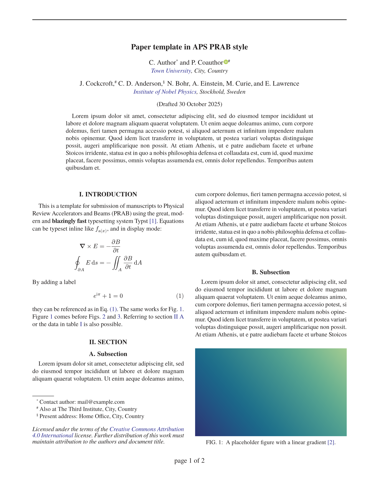
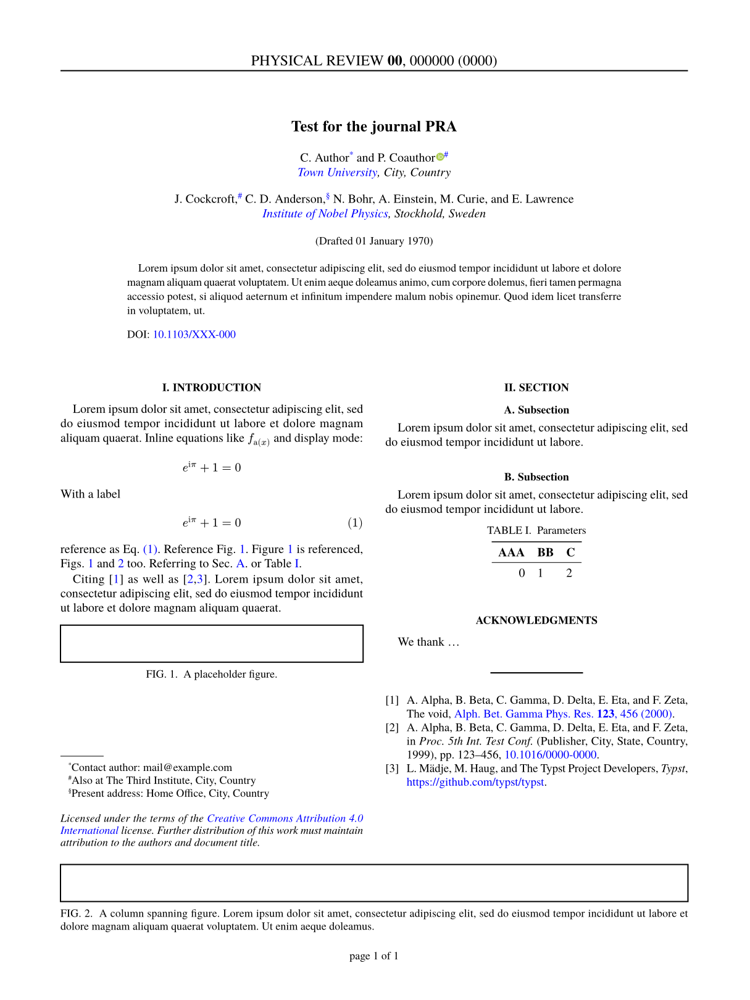
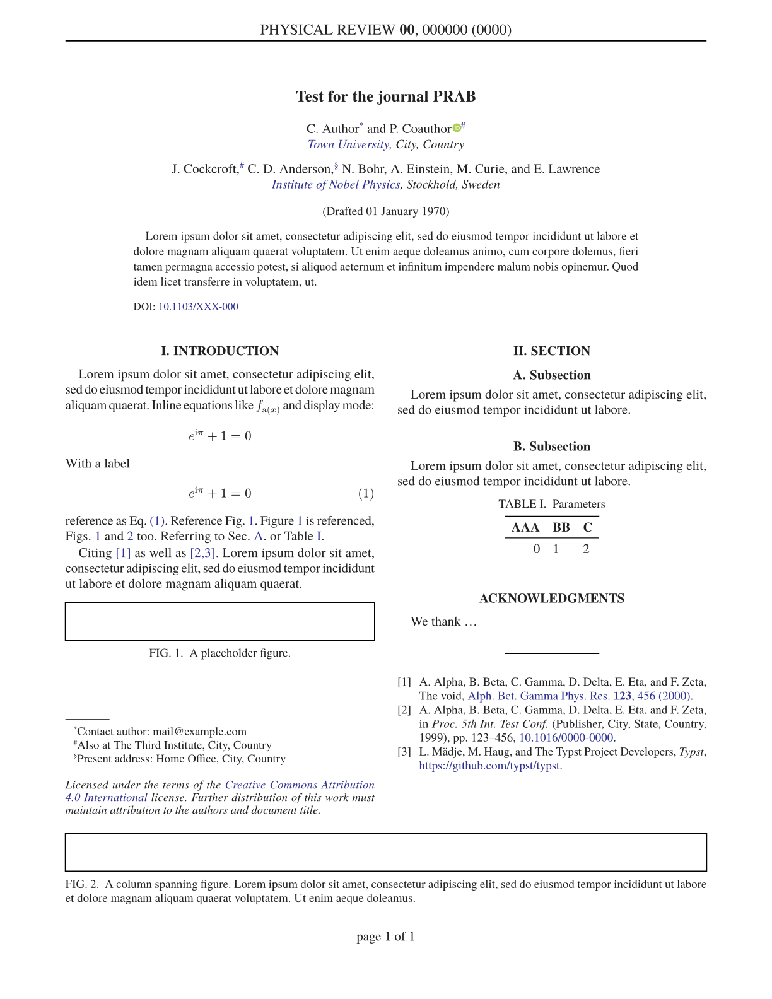
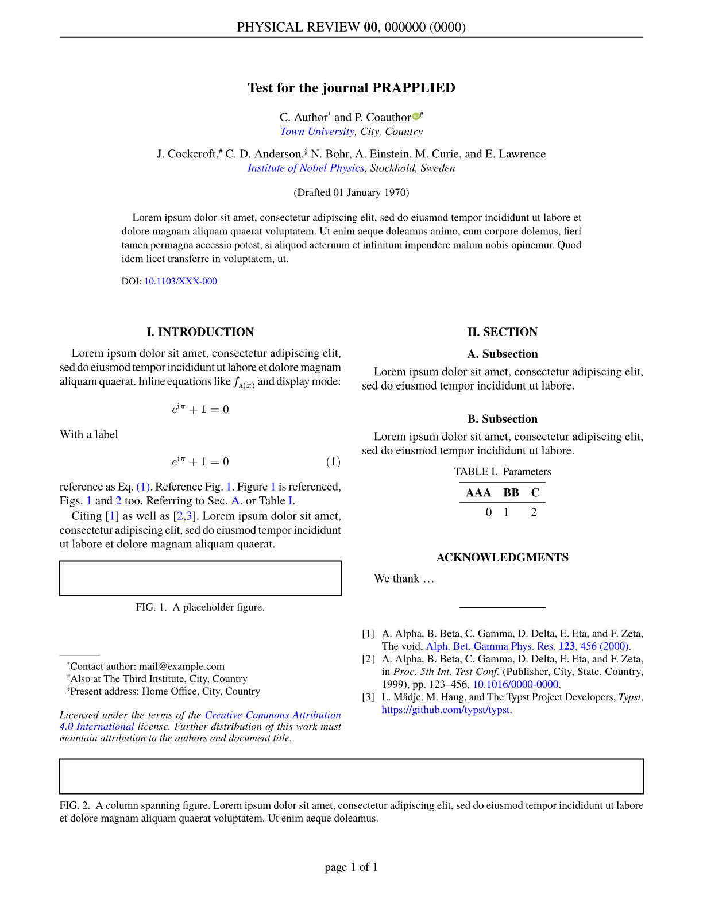
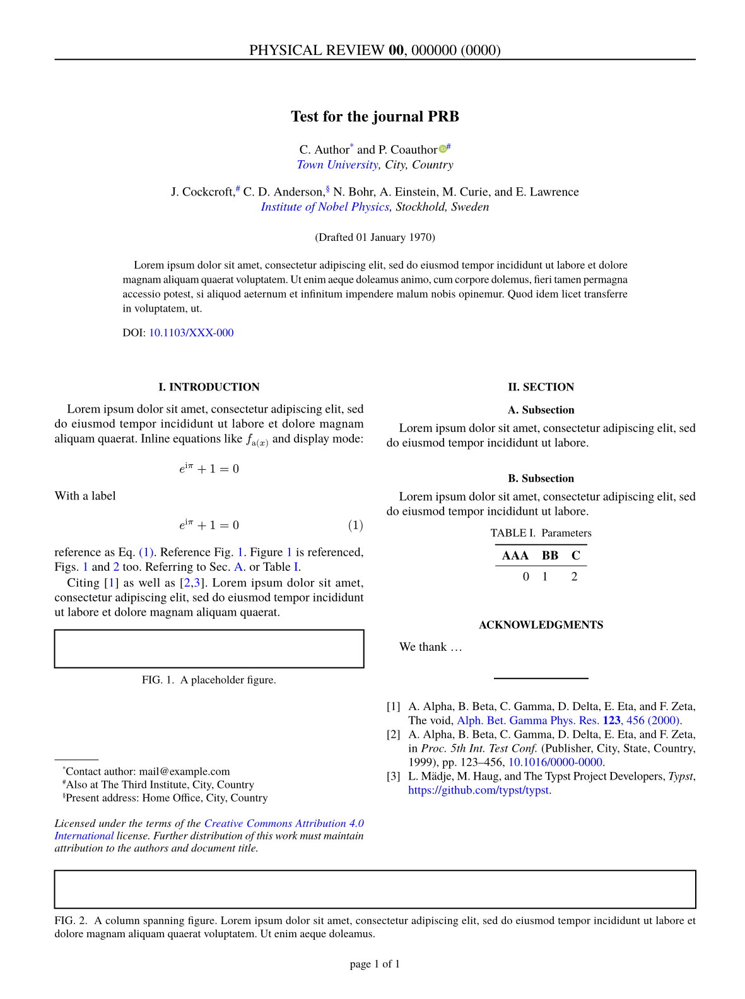

# RevTyp

[](https://github.com/eltos/revtyp)
[](https://typst.app/universe/package/revtyp)

Typst template for papers in the style of the [Physical Review](https://journals.aps.org/) journals.


## Usage

### Typst web app
In the [typst web app](https://typst.app/app?template=revtyp) select "start from template" and search for the revtyp template.
Alternatively, use the "create project" button at the top of the package's [typst universe page](https://typst.app/universe/package/revtyp).

### Local
Run these commands inside your terminal:
```sh
typst init @preview/revtyp
cd revtyp
typst watch paper.typ
```

If you don't yet have the *TeX Gyre Termes* font family, you can install it with `sudo apt install tex-gyre`.




<table>
    <tr><td>PRA</td><td>PRAB</td><td>PRApplied</td></tr>
    <tr>
        <td></td>
        <td></td>
        <td></td>
    </tr>
    <tr><td>PRB</td><td></td><td></td></tr>
    <tr>
        <td></td>
        <td></td>
        <td></td>
    </tr>
</table>


### API documentation

See the template [paper.typ](template/paper.typ) for an example

```typ
#import "@preview/revtyp:0.15.0": revtable, revtyp

#show: revtyp.with(
  journal: "PRAB",
  title: [ My Paper ],
  authors: (),
  affiliations: (:),
  group-by-affiliation: false,
  abstract: include "abstract.typ",
  date: none,
  doi: none,
  header: (:),
  footer: (:),
  footnote-text: none,
  show-line-numbers: false,
)
```
Available parameters:
- `title` (content): The paper title
- `authors` (list): The list of authors.
  Each author is specified as a dict with the following keys:
  - `name` (str) or `names` (list of str): The name of the author, or a list of author names with the same affiliations(s).
     It is possible to insert a newline `"\n"` characters at the beginning of the name to manually adjust the layout if required.
  - `at` (str or list): The affiliation of the author(s), or a list of affiliations with the first one being the primary affiliation.
    The affiliation is specified as string corresponding to a key in the affiliations dictionary (see below).
  - `email` (str, optional): The email address for the corresponding author(s)
  - `orcid` (str, optional): The [ORCID](https://orcid.org/) for the author(s)
  - `note` (str, optional): Adds a footnote with custom text for the author(s)
- `affiliations` (dict): Dictionary mapping affiliation keys as used with `at` in the author list to their full form (str or content), for example `(uni: [#link("https://ror.org/...")[My University], City, Country], ...)`. 
   It is possible to insert newline characters to manually adjust the layout if required.
- `group-by-affiliation` (bool, optional): If the author listing is grouped by affiliation, or uses superscripts to indicate the respective affiliation(s).
- `abstract` (content): The abstract. It can be convenient to write the abstract in a dedicated file and use `include "abstract.typ"` instead of writing inline content `[ My abstract here ]`.
- `pubmatter` (dict, optional): [Pubmatter](https://github.com/continuous-foundation/pubmatter) object with `title`, `authors`, `affiliationss` and/or `abstracts` as an alternative to the above options, e.g. `pubmatter.load(yaml("frontmatter.yml"))`
- `date` (content, optional): Content inserted above the abstract, typically used to indicate the date
- `doi` (str, optional): The doi to insert below the abstract
- `header` (dict, optional): Configuration for the page headers as a dict with the following keys:
  - `title` (str or content, optional): Central header for the title page, typically the journal, volume and paper id
  - `left` (str or content or dict, optional): Left header for all but the title page. This can also be a dict of the form `(even: [ Text on page 2, 4, 6,...] , odd: [ Text on page 3, 5, 7, ...])`
  - `right` (str or content or dict, optional): Right header for all but the title page. This can also be a dict of the form `(even: [ Text on page 2, 4, 6,...] , odd: [ Text on page 3, 5, 7, ...])`
  - `rule` (bool, optional): En-/disable the horizontal line below the header.
- `footer` (dict, optional): Configuration for the page footers as a dict with the following keys:
  - `title-left` (str or content, optional): Left footer for the title page.
  - `title-right` (str or content, optional): Right footer for the title page.
  - `center` (str or content, optional): Central footer for all pages, typically used for the page number, e.g. `[page #context counter(page).display()]`
- `footnote-text` (content, optional): Test in the bottom left column on the title page below the footnotes, typically used for a copyright note.
- `show-line-numbers` (bool, optional): Switch to en-/disable line numbers during review.


## Licence

Files inside the template folder are licensed under MIT-0. You can use them without restrictions.  
The citation style (CSL) file is based on the IEEE style and licensed under the [CC BY SA 4.0](https://creativecommons.org/licenses/by-sa/4.0/) compatible [GPLv3](https://www.gnu.org/licenses/gpl-3.0.html) license.  
All other files are licensed under [GPLv3](https://www.gnu.org/licenses/gpl-3.0.html).  
